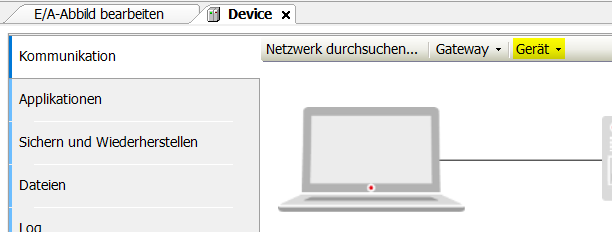

# Erweiterte Kompetenzübung
__Datum:__ 10.01.2019  
__Autor:__ Mario Fentler 5CHIT  
__Teammitglieder:__  
Tesanovic, Özer, Rousavy - 5AHIT

Ziel dieser Übung ist es über Codesys echte Hardware anzusprechen und über einen Button eine Lampe zum Leuchten zu bekommen.

## Voraussetzungen
Folgende Dinge müssen im Vorfeld heruntergeladen werden:  
* CODESYS V3.5 SP13 Patch1  
* [CODESYS Controll for Raspberry Pi SL 3.15.13.20](https://store.codesys.com/codesys-control-for-raspberry-pi-sl.html#Alle%20Versionen)  
(Alle Versionen -> 3.15.13.20)  
* [WAGO USB Treiber für Ethercat](https://www.wago.com/at/io-systeme/feldbuskoppler-ethercat/p/750-354)  
(Downloads -> Gerätedateien -> Gerätetreiber -> "WAGO USB Service Kabel und Treiber / Serie 750 und 857")

## Arbeitsschritte
Als erstes wird ein neues Standardprojekt in Codesys erstellt. Anschließend wird das vorher heruntergeladene __Codesys Controll for Raspi__ Package hinzugefügt. Dazu: _Tools/Packagemanager/Installieren_  

Das Package braucht man um jetzt beim Erstellen eines neuen Standardprojekts das Gerät "Codesys Controll for Raspberry Pi" auswählen zu können.  

Anschließend ändert man die GPIOs. Dazu klickt man mit der __Rechten Maustaste auf GPIOS A/B__ -> __Gerät aktualisieren__ -> __GPIOS B+__
  
Wenn man jetzt nochmal mit der Rechten Maustaste auf die GPIOs klickt -> E/A-Abbild bearbeiten -> dann sind dort die GPIO In-/Output Adressen aufgelistet. Denen kann man Variablen zuweisen.  

Als nächstes wird der Wago USB Treiber installiert:  
Die ZIP Datei wird entpackt (nur das File ohne "No_modules" ist von Bedeutung). Dieses wird dann in Codesys über __Tools__/__Geräterepo__, __installieren__ hinzugefügt.  

Die Steuerung wird über einen Raspberry Pi angesprochen. Diesen muss man natürlich auch noch als Gerät hinzufügen um ihn nutzen zu können.

Der Raspberry Pi befindet sich im Pria Netzwerk. Um damit zu kommunizieren muss man sich auch in diesem Netzwerk befinden. Anschließend geht man in Codesys auf __Tools__/__Update Raspberry__ -> __Durchsuchen__  
Dort kann man auch noch das installierte Codesyscontrol Package überprüfen und gegebenenfalls ändern oder den Raspberry Pi starten oder stoppen.

Wenn man Programme dann auf der Hardware ausführen will klickt man auf __Online__/__Einloggen__ -> __Gerät__/__Bevorzugte Geräte verwalten__ -> __Neues hinzufügen__ und gibt dort die IP-Adresse vom Pi an.

Anschließend kann man die Programme so ausführen, wie wir das auch schon bei den Übungen davor gemacht haben. Der einzige Unterschied ist, dass wir uns jetzt nicht mehr im Simulationsmodus befinden.

Davor muss aber noch ein Master eingefügt werden. Der Master entscheidet welcher Slave das Signal empfangen darf. Der Master ist eine reine Softwareimplementierung. Die Slaves hingegen sind die angeschlossenen Hardwareslots.  
Um nun einen neuen __Master__ hinzuzufügen:  
__Rechte Maustaste auf Device__ -> __Geräte anhängen__ -> __Ethercat__ -> __Master__

Als nächster Schritt werden nun die Slaves hinzugefügt. Die Slaves besitzen alle eine Nummer die auf der Hardware ersichtlich ist. Je nach Nummer kann man herausfinden ob es sich dabei um eine Input- oder eine Outputkarte handelt.  
__Rechte Maustaste auf EtherCAT Master__ -> __Gerät anhängen__ -> __750-354 EtherCAT Fieldbus__ (Die Nummer muss man auch von der Hardware ablesen) -> __Gerät anhängen__ -> Nach __WAGO__ suchen.  
Dort kann man jetzt die einzelnen In/Output Karten auswählen. Dabei muss man auch darauf achten, dass man sie in der Reihenfolge hinzufügt, in der sie auch gesteckt sind.

Für unsere Übung brauchen wir die Karten 530,530,430,430. Da es die so aber nicht in der Liste gibt müssen wir die __750-5xx/750-4xx__ mit jeweils entweder __8b in__ oder __8b out__ nehmen, jenachdem ob wir Input oder Output haben.  
Das Resultat sieht dann so aus:  
